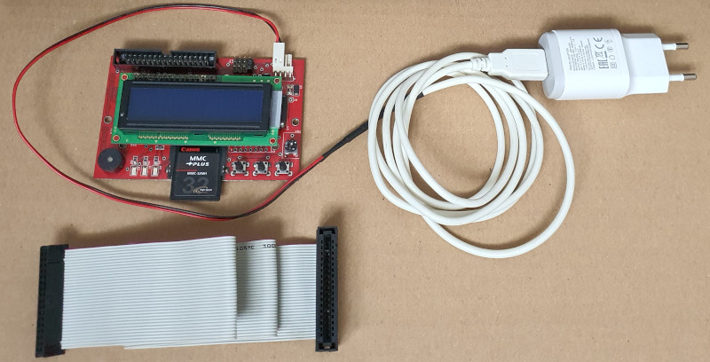
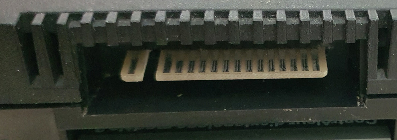
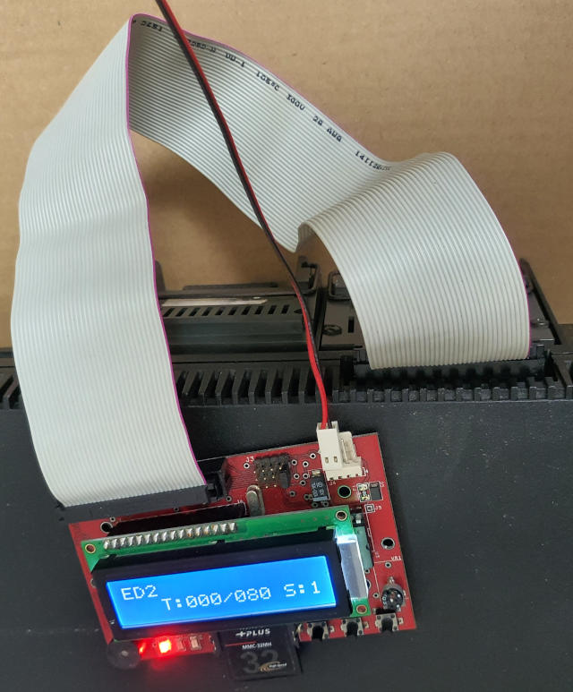
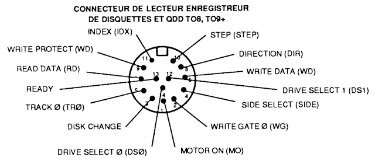
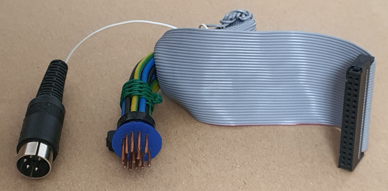
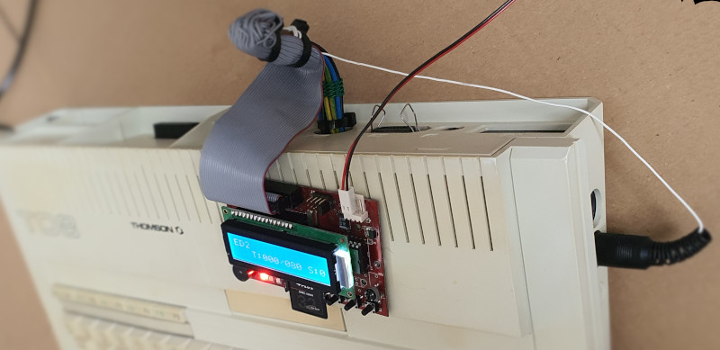
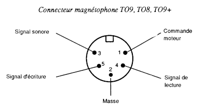
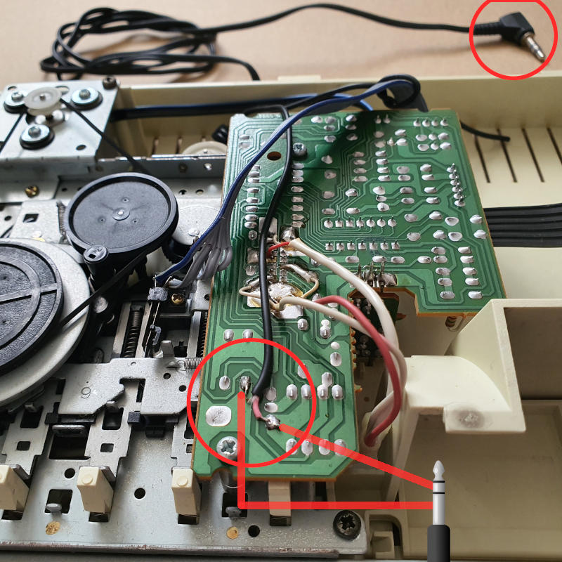
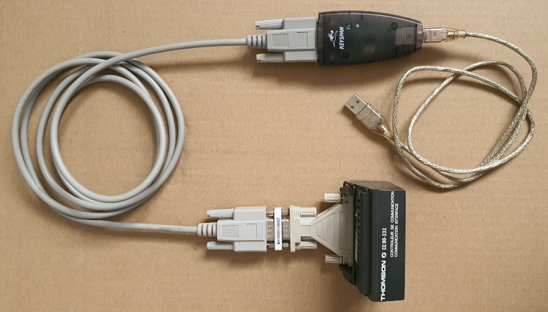

# Comment jouer sur le matériel réel

Il existe plusieurs méthodes pour utiliser Evil Dungeons II sur un Thomson, voici un résumé des possibilités selon le modèle.

| Méthode | MO5 | MO6 | TO7/70 | TO9 | TO8 | TO8D/TO9+ |
|---------|-----|-----|--------|-----|-----|-----------|
| SDDRIVE |  Oui |  Oui |  Oui |  Non |  Oui |  Oui mais   le lecteur interne    doit être désactivé |
| HxC externe |  Oui avec   CD90-351 et   câble DIN 14 - 3.5" |  Oui avec   CD90-351 et   câble DIN 14 - 3.5" |  Oui avec   CD90-351 et   câble DIN 14 - 3.5" |  Oui avec   nappe droite   5.25" - 3.5" |  Oui avec   câble DIN 14 - 3.5" |  Oui avec   câble DIN 14 - 3.5" |
| Cassette audio |  Oui avec extension   mémoire 64 Ko |  Oui |  Non |  Non |  Non |  Non |
| Disquette créée   sur PC ou Amiga |  Oui avec   CD90-351,   DD90-352 et   câble DIN 14 |  Oui avec   CD90-351,   DD90-352 et   câble DIN 14 |  Oui avec   CD90-351,   DD90-352 et   câble DIN 14 |  Oui |  Oui avec   DD90-352 et   câble DIN 14 |  Oui |
| Disquette créée   avec CC90 |  Oui avec   CC90-232 modifié,   Mégabus,   CD90-351,   câble DIN 14   et DD90-352 |  Oui avec   CC90-232 modifié,   Mégabus,   CD90-351,   câble DIN 14   et DD90-352 |  Oui avec   CC90-232,   CD90-351,   câble DIN 14   et DD90-352 |  Oui avec   CC90-232 |  Oui avec   CC90-232 modifié,   câble DIN 14   et DD90-352 |  Oui avec   CC90-232 modifié |
| Mégarom T.2 |  Non |  Non |  Oui après   installation |  Oui après   installation |  Oui après   installation |  Oui après   installation |

N.B. : le CD90-351 est peu courant.

N.B.2 : Il existe d'autres méthodes :
- [DC Transferts](http://dcmoto.free.fr/programmes/dctransferts/index.html) sur TO8, TO8D ou TO9+
- [SD2DSK](http://dcmoto.free.fr/programmes/sddrive-sd2dsk/index.html) sur TO8, TO8D ou TO9+
- [SDTRANSFERT](http://dcmoto.free.fr/programmes/sdtransfert/index.html) tous les MO et tous les TO

# [SDDRIVE](http://dcmoto.free.fr/bricolage/sddrive/index.html)

Le moyen le plus simple est d'utiliser un [SDDRIVE](http://dcmoto.free.fr/bricolage/sddrive/index.html) et mettre **ED2.sd** sur une carte SD.

Attention  sur TO8D et TO9+ il faut faire la manipulation suivante pour désactiver le contrôleur interne si un lecteur de disquette y est branché :
<pre>POKE &HE7E7, &HD4
POKE &H6081, &HD4
EXEC &HE025</pre>

Il n'est malheureusement pas possible d'utiliser un SDDRIVE sur TO9, car le contrôleur interne de disquette n'est pas désactivable.

# [HxC](https://hxc2001.com/floppy_drive_emulator/) externe

Sur TO9, il est très simple d'y brancher un [HxC](https://hxc2001.com/floppy_drive_emulator/) ou [HxC Gotek](https://hxc2001.com/docs/gotek-floppy-emulator-hxc-firmware/) configuré en Shugart et contenant l'image **ED2.hfe**.
Pour cela il suffit d'utiliser une nappe droite 5.25" - 3.5" de lecteur disquette. Brancher le HxC sur le côté 3.5" et brancher l'autre côté 5.25" sur le [connecteur 5](https://web.archive.org/web/20210805185020if_/https://www.old-computers.com/museum/photos/Thomson_To9_Rear_1.jpg) à l'arrière du TO9. Il faut prévoir une alimentation 5V externe pour le lecteur HxC.

| Le HxC et le connecteur 5 du TO9 | Le HxC connecté |
|---|---|
|     |  |

Pour les autres modèles (TO8, TO8D, TO9+ ou autre modèle avec CD90-351), il faut faire un câble DIN 14 pour le lecteur externe de disquette.
Voici la correspondance entre les pins et la nappe :

| Connecteur DIN 14 du TO8, TO8D, TO9+ et contrôleur CD90-351 | Correspondance nappe | Adaptateur |
|---|---|---|
|  | DIN 01 = 16 MOTOR ON DIN 02 = 24 WRITE GATE 0 DIN 03 = 02 DISK CHANGE DIN 04 = 32 SELECT SIDE DIN 05 = 26 TRACK 0 DIN 06 = 22 WRITE DATA DIN 07 = 30 READ DATA DIN 08 = 18 DIRECTION DIN 09 = 28 WRITE PROTECT DIN 10 = 20 STEP DIN 11 = 08 INDEX DIN 12 = 12 DRIVE SELECT 1 DIN 13 = 34 READY DIN 14 = 10 DRIVE SELECT 0 |  |

Voici comment faire l'adaptateur DIN 14 - nappe disquette :
- Prendre un petit morceau de papier, le mettre contre la prise DIN et percer les 14 trous avec un crayon ou équivalent.
- Une fois le papier troué avec les 14 pins, reporter et percer les trous dans un support plus solide (plastique, bois, ou autre matière).
- Prendre 14 bouts de câble électrique en cuivre de diamètre 1,5. Il faut les prendre assez long (10 cm) pour manipuler l'adaptateur.
- Souder les fils de la nappe mentionnés dans le tableau ci-dessus aux bouts de câble électrique puis les isoler.
- Passer les bouts de câble électrique soudés dans le trou correspondant du support DIN 14.
- Solidifier le tout avec des colliers serre-câble ou équivalent.
- Relier les fils de masse (numéros impair) à la prise magnétophone ou à la sortie son
  |  |  |
  |---|---|
  |  |  |

Une fois le HxC connecté, vous pourrez copier le contenu de **ED2.hfe** sur une disquette dans le lecteur interne.
Pour cela, entrer les instructions suivantes en gras depuis le BASIC 128 ou 512 :
- activer la vérification : **VERIFY ON**
- formater la face 0 avec un facteur d'entrelacement de 2 : **DSKINI 0,2**
- copier la face 2 sur la face 0 : **BACKUP 2 TO 0**

Sur les modèles autres que le TO9 (dont le lecteur interne ne gère qu'une face), vous pourrez copier la deuxième face avec les instructions suivantes en gras depuis le BASIC 128 ou 512 :
- activer la vérification : **VERIFY ON**
- formater la face 1 avec un facteur d'entrelacement de 2 : **DSKINI 1,2**
- copier la face 3 sur la face 1 : **BACKUP 3 TO 1**

# Cassette audio

Sur MO5 et MO6, il est possible de faire une cassette audio avec le fichier **ED2.k5** en utilisant [DCMOK7](http://dcmoto.free.fr/emulateur/prog/dcmok7_20240928.zip) pour faire un fichier .wav à partir du fichier .k5.

Sur MO6 le débit de 2400 bauds peut être utilisé pour réduire de moitié le temps de chargement.

Sur MO5 une [extension mémoire](http://dcmoto.free.fr/bricolage/extension_512k/index.html) de 64 Ko ou plus est nécessaire pour charger tout le jeu en mémoire.

L'[idéal](http://dcmoto.free.fr/documentation/faq/mok7.html) est de raccorder directement une prise jack au lecteur de cassette pour une fiabilité maximale. Il existe cette [interface pour MO5](http://dcmoto.free.fr/bricolage/interface_audio/index.html) qui remplace le lecteur de cassette.

Le MO6 est le seul modèle qui n'est pas équipé de connecteur magnétophone externe, mais il est [possible](https://forum.system-cfg.com/viewtopic.php?p=246642#p246642) de raccorder directement une prise jack au lecteur de cassette interne du MO6 :
 

Une fois la prise jack branchée à un PC ou à un lecteur audio, allumer le MO5 ou MO6 (choisir BASIC 1.0), entrer la commande **RUN"** et lancer la lecture du .wav

Il est également possible d'utiliser un [SDLEP-READER](http://dcmoto.free.fr/bricolage/sdlep-reader/index.html) ou un [SDLEP-READER TFT](http://dcmoto.free.fr/bricolage/sdlep-tft/index.html). La création d'un fichier .lep avec [DCLEP](http://dcmoto.free.fr/emulateur/prog/dclep_20210507.zip) nécessite un enregistrement .wav (voir étape précédente).

# Disquette créée sur PC ou Amiga 

Il est possible d'écrire l'image **ED2.fd** sur disquette DD avec l'outil adapté à votre système :
- Windows : [Omniflop](http://www.shlock.co.uk/Utils/OmniFlop/OmniFlop.htm),
- DOS : [DCFDUTIL](http://dcmoto.free.fr/emulateur/dos/dcfdutil33.zip),
- Amiga : [ToDisk](https://aminet.net/package/disk/misc/ToDisk2.6).

Attention, sous DOS avec DCFDUTIL, la face 1 qui contient la version MO n'est pas gérée. Pour faire une disquette comptible MO avec ce logiciel il faut donc :
- sur PC copier la face 1 de **ED2.fd** sur la face 0 de la disquette
- sur Thomson TO8, TO8D ou TO9+, copier la face 0 sur la face 1 avec les commandes **VERIFY ON**, **DSKINI 1,2** et **BACKUP 0 TO 1**
- sur PC copier la face 0 de **ED2.fd** sur la face 0 de la disquette

# Disquette créée avec [CC90](http://www.pulsdemos.com/cc90.html)

Il est possible d'écrire l'image **ED2.fd** sur disquette directement sur un Thomson avec une interface CC90-232, un PC équipé d'un port série et un câble série câblé de la façon suivante :

| DB25 | DB9 |
|---|---|
| 2 | 3 |
| 3 | 2 |
| 4 | 7 |
| 5 | 8 |
| 7 | 5 |
| 20 | 4 |

Attention, l'interface CC90-232 ne fonctionne en mode série que sur TO7/70 et TO9. En effet, elle nécessite une sortie -5 Volts qui n'est présente que sur ces modèles. Sur TO8, TO8D, TO9+, MO5 et MO6 il faut donc faire une modification, expliquée dans le fichier doc/modif.html de la documentation de CC90.

Une fois le Thomson et le PC connectés via l'interface, il faut saisir et exécuter le programme BASIC du fichier doc/run.html pour initier la communication. Ensuite, 
- mettre une disquette qui contiendra ED2 dans le Thomson
- mettre le fichier **ED2.fd** dans le répertoire **cc90** (là où vous avez décompressé l'archive cc90.zip)
- saisir les lignes de commandes suivantes, en gras, sur le PC :
  - installer CC90 sur le Thomson depuis le PC : **cc90 --install**
  - formater la face 0 de la disquette avec un entrelacement de 2 : **cc90 --format -e2 0**
  - attendre que le formatage soit terminé
  - écrire la face 0 de la disquette : **cc90 --disk ED2.fd 0**
  - vérifier le contenu de la face 0 de la disquette : **cc90 --dir 0**
- commandes supplémentaires pour TO8, TO8D, TO9+, MO5 et MO6 :
  - formater la face 1 de la disquette avec un entrelacement de 2 : **cc90 --format -e2 1**
  - attendre que le formatage soit terminé
  - écrire la face 1 de la disquette : **cc90 --disk ED2.fd 1**
  - vérifier le contenu de la face 1 de la disquette : **cc90 --dir 1**

Pensez à créer de la même façon une disquette physique ayant le contenu de cc90.sap pour ne pas avoir à ressaisir le programme BASIC la prochaine fois.

# [Mégarom T.2](https://megarom.forler.ch/fr/) 

La Mégarom T.2 est une cartouche MEMO7 (pour TO uniquement) dont le contenu peut être mis à jour depuis le Thomson.

La disquette **ED2MegaromT2** permet, après avoir sauvegardé le contenu de la cartouche, d'y installer Evil Dungeons II, avec possibilité de remise en l'état initial depuis la sauvegarde faite. Il faut donc passer par la même étape de création de disquette émulée ou physique que pour **ED2**, mais une fois l'installation faite, le jeu est facilement jouable sans disquette.
